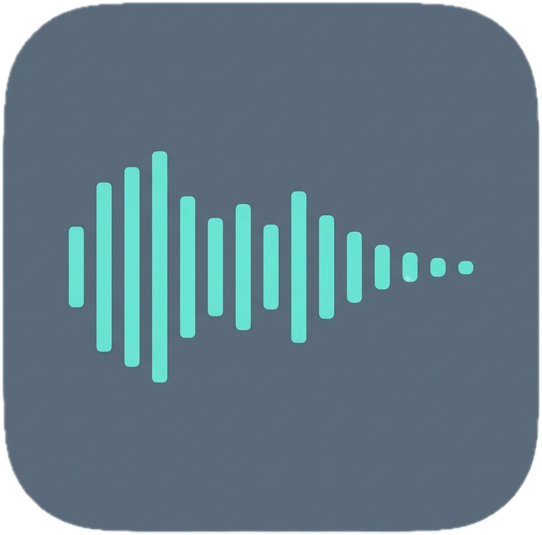

<p align="center">
  
</p>

<h1 align="center">Fadeo</h1>

<p align="center">
  <strong>Your Mac plays the right sound for what you're doing — automatically.</strong><br>
  And you control exactly how "right" is defined, down to the app, the desktop, and the second.
</p>

<p align="center">
  <em>macOS 14+ · native Swift/SwiftUI · open source (GPLv3) · early development</em>
</p>

---

Fadeo watches what you're doing — the app you're in, which desktop/Space you're on,
whether you're in a meeting, your Focus mode, the time — and plays, switches, fades, or
stops audio to match. Group apps into **Workspaces**, point each at a sound (a Spotify or
Apple Music playlist, your own files, or an ambient loop), tune the fades and precedence,
and forget it's there.

Two things it refuses to compromise on:

- **Total customizability** — every trigger, timing value, fade curve, and precedence
  rule is a setting, never a hardcoded assumption.
- **Invisible efficiency** — a background agent that runs all day and stays at ≈0% idle
  CPU and single-digit MB. Zero polling; everything is event-driven.

## Bring your own sound

Fadeo doesn't lock you into a library. Point a workspace at:

- **Spotify / Apple Music** — a playlist, album, or "just play/pause what's already going"
- **Your own files or folders** — anything `AVAudioEngine` can play
- **Bundled ambient starter set** — rain, brown/pink noise, lo-fi loops to get going

## Build

Requires a full **Xcode** (not just Command Line Tools). The build wraps everything:

```sh
make          # generate project, build
make run      # build and launch
make test     # run FadeoCore unit tests
```

> Uses the Xcode at `DEVELOPER_DIR` (defaults to `/Applications/Xcode.app`; override with
> `make DEVELOPER_DIR=/Applications/Xcode-beta.app/Contents/Developer …`).

## Architecture

See [`PLAN.md`](PLAN.md) for the full spec: the pure resolver core, the four-band
precedence model, the sensor/actuator layers, and the efficiency contract.

```
Sensors (event-driven)  →  Context  →  resolve()  →  Reconciler  →  Actuators
 app · space · meeting          pure, unit-tested      diff only     conduct + play
 · focus · time                 (FadeoCore)
```

## License & pricing

Fadeo is **open source under [GPLv3](LICENSE)** — build it yourself, fork it, learn from
it. The official signed & notarized build carries a paid license that funds development;
unlicensed use is **fully functional** with an occasional gentle reminder (WinRAR-style —
never a lockout, never interrupts your audio).

---

<p align="center"><sub>Fadeo · the fade is the point</sub></p>
